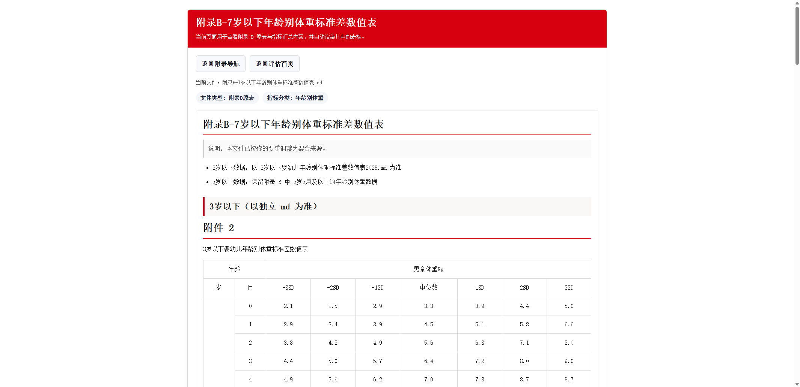

# 7 岁以下儿童营养评估网页

一个面向院内 / 内网场景的静态网页工具，用于根据儿童基础测量信息自动计算并输出：

- 表 2：儿童生长水平评价
- 表 3：儿童营养状况评价

项目基于附录标准差表实现，适合部署到 IIS 或任意静态文件服务器，无需数据库、无需后端服务、无需联网即可运行。

## 页面预览



## 项目特点

- 支持 7 岁以下儿童营养评估
- 支持男童、女童分别计算
- 支持出生日期、测量日期自动换算月龄与实际年龄
- 支持体重、身长 / 身高、BMI 联动计算
- 自动输出表 2 与表 3 的最终结果
- 附带附录资料导航页，可直接查看各指标标准表
- 纯前端静态实现，适合内网离线部署
- 提供 `web.config`，可直接部署到 IIS

## 适用范围

当前页面围绕以下 4 类核心指标进行评估：

- 年龄别体重
- 年龄别身长 / 身高
- 身长 / 身高别体重
- 年龄别 BMI

页面中不包含年龄别头围评价。

## 技术说明

- 前端：HTML + CSS + 原生 JavaScript ES Module
- 数据来源：整理后的附录标准差表
- 运行方式：静态页面直接打开，或通过本地 / IIS 静态站点访问
- 外部依赖：无

说明：

- 浏览器访问时不依赖 Node.js、npm 或任何打包工具
- Python 仅用于本地临时启动静态文件服务，生产部署不是必需条件

## 目录结构

```text
nutrition-eval-web/
├─ index.html                 主评估页面
├─ appendix-index.html        附录导航页
├─ appendix-viewer.html       附录查看页
├─ app.mjs                    主页面交互逻辑
├─ appendix-viewer.mjs        附录页面渲染逻辑
├─ styles.css                 主样式文件
├─ web.config                 IIS 静态站点配置
├─ favicon.svg                站点图标
├─ data/
│  └─ standards-data.mjs      标准差数据
├─ lib/
│  └─ evaluator.mjs           评估核心逻辑
├─ scripts/
│  └─ generate_standards.py   标准数据生成脚本
├─ tests/
│  └─ run_sample_tests.mjs    样例测试
└─ appendix/                  附录资料文件
```

## 本地运行

### 方式一：直接部署为静态站点

将整个 `nutrition-eval-web` 文件夹作为网站根目录即可。

首页访问：

- `index.html`

附录导航页访问：

- `appendix-index.html`

### 方式二：使用 Python 临时启动

在项目目录执行：

```powershell
cd /d D:\YYK_JS\nutrition-eval-web
python -m http.server 8080
```

浏览器打开：

- [http://127.0.0.1:8080](http://127.0.0.1:8080)

## IIS 部署

### 1. 部署文件

将整个 `nutrition-eval-web` 文件夹上传到服务器，例如：

```text
D:\nutrition-eval-web
```

### 2. IIS 新建站点

建议配置：

- 物理路径：`D:\nutrition-eval-web`
- 绑定端口：例如 `8098`
- 默认文档：`index.html`

### 3. 配置说明

项目已自带 `web.config`，主要作用：

- 设置 `index.html` 为默认首页
- 为 `.mjs` 配置正确的 MIME Type
- 为 `.md` 配置可访问类型
- 关闭目录浏览
- 关闭强缓存，避免内网旧缓存影响页面更新

### 4. 访问地址

部署完成后可直接使用：

```text
http://服务器IP:端口/
```

例如：

```text
http://172.16.182.166:8098/
```

## 数据与规则说明

- 评估逻辑基于整理后的附录标准差表实现
- 页面会根据性别、年龄、体重、身长 / 身高自动匹配对应标准
- 结果最终归类到表 2 与表 3 中进行展示
- 部分年龄区间与测量方式的换算逻辑，已在代码中按当前项目规则实现

如果后续需要替换标准表，只需要更新数据文件，页面逻辑本身不需要大改。

## 测试

运行样例测试：

```powershell
node .\tests\run_sample_tests.mjs
```

如果只是内网部署静态网页，测试不是必需步骤；如果调整了评估规则，建议重新执行一次。

## 常见维护操作

### 更新样式或逻辑后页面不生效

优先检查以下几项：

- 是否已将 `index.html`、`styles.css`、`.mjs` 文件同步到服务器
- 是否同步了附录相关页面：`appendix-index.html`、`appendix-viewer.html`
- 浏览器是否仍在使用旧缓存，可尝试 `Ctrl + F5`

### 附录页面样式异常

附录页除了公共样式外，还依赖 `appendix-viewer.html` 内部样式。  
如果附录页在某台电脑上显示正常、另一台电脑显示异常，通常需要检查：

- 服务器文件是否为最新版本
- 浏览器缓存是否未刷新
- 老版本浏览器是否对部分 CSS 写法兼容较差

## 后续可扩展方向

- 增加更多标准表切换能力
- 增加打印版结果输出
- 增加导出 Word / PDF 的能力
- 增加患者信息留档或批量导入能力

## 说明

本项目当前为院内业务辅助工具版本，重点是：

- 页面直观
- 结果明确
- 易于内网部署
- 易于后续继续维护

如果后续需要继续扩展为完整系统，可在当前静态版基础上继续增加后端接口、数据库和导出模块。
