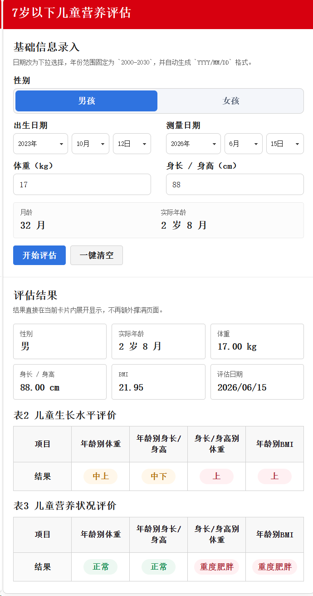

# 儿童营养评估网页

一个面向院内 / 内网场景的纯前端静态网页工具，用于根据儿童基础测量信息，自动输出对应年龄段的营养评估结果，并提供附录指标表在线查阅能力。

当前版本已经支持：

- `7 岁以下` 儿童生长水平与营养状况评估
- `7 岁及以上` 儿童青少年生长筛查、BMI 筛查、身高发育等级评估
- 儿童营养评估附录分类查看
- 膳食营养素参考摄入量附录分类查看
- 离线部署到 IIS 或任意静态文件服务器

## 页面预览



## 功能概览

### 1. 主评估页面

主页面输入项包括：

- 性别
- 出生日期
- 测量日期
- 体重（kg）
- 身长 / 身高（cm）

系统会自动换算：

- 月龄
- 实际年龄
- BMI

### 2. 7 岁以下评估结果

`7 岁以下` 按标准差法输出两张结果表：

- `表 1：儿童生长水平评价`
- `表 2：儿童营养状况评价`

涉及的评估指标包括：

- 年龄别体重
- 年龄别身长 / 身高
- 身长 / 身高别体重
- 年龄别 BMI

### 3. 7 岁及以上评估结果

`7 岁及以上` 不再输出 7 岁以下的两张表，而是输出以下 3 项筛查 / 评价结果：

- 年龄身高筛查生长迟缓等级结果
- 年龄 BMI 筛查营养状态结果
- 身高发育等级判定结果

其中：

- `年龄身高筛查` 用于判断是否存在生长迟缓
- `年龄 BMI 筛查` 用于判断中重度消瘦、轻度消瘦、正常、超重、肥胖
- `身高发育等级判定` 采用标准差法，输出上等、中上等、中等、中下等、下等

### 4. 儿童营养评估附录

系统提供独立的 `儿童营养评估附录` 页面，按类别查看整理后的评估标准表。

目前附录分为 3 组：

- `评价方法`
- `7 岁以下`
- `7 岁及以上`

#### 评价方法

- 儿童生长水平百分位评价方法

#### 7 岁以下附录

- 年龄别体重
- 年龄别身长 / 身高
- 身长 / 身高别体重
- 年龄别 BMI

其中部分指标还提供：

- 男女总表
- 百分位表

#### 7 岁及以上附录

- 年龄身高筛查界值表
- 年龄 BMI 筛查界值表
- 身高发育等级标准差表

### 5. 膳食营养素参考摄入量附录

系统另提供独立的 `膳食营养素参考摄入量附录` 页面，用于查看整理后的膳食营养素参考摄入量附表。

当前已收录：

- 附表 3-1 膳食能量需要量（EER）
- 附表 3-2 膳食蛋白质参考摄入量
- 附表 3-3 膳食脂肪及脂肪酸参考摄入量
- 附表 3-4 膳食碳水化合物参考摄入量
- 附表 3-5 膳食宏量营养素可接受范围（AMDR）
- 附表 3-6 膳食微量营养素平均需要量（EAR）
- 附表 3-7 膳食矿物质推荐摄入量（RNI）或适宜摄入量（AI）
- 附表 3-8 膳食维生素推荐摄入量（RNI）或适宜摄入量（AI）
- 附表 3-9 膳食营养素降低膳食相关非传染性疾病风险的建议摄入量（PI-NCD）
- 附表 3-10 膳食微量营养素可耐受最高摄入量（UL）
- 附表 3-11 水的适宜摄入量
- 附表 3-12 其他膳食成分成年人特定建议值（SPL）和可耐受最高摄入量（UL）

说明：

- 膳食附录与儿童营养评估附录是两个独立页面，左侧菜单分别进入。
- 附录查看器支持渲染 Markdown 表格与 HTML 表格。
- 对较宽的膳食附表已启用更宽页面和更紧凑表格样式，尽量减少横向滚动。

## 适用范围

### 7 岁以下

当前基于整理后的标准差表与百分位表，支持以下指标：

- 年龄别体重
- 年龄别身长 / 身高
- 身长 / 身高别体重
- 年龄别 BMI

不包含：

- 年龄别头围

### 7 岁及以上

当前支持以下评估：

- 年龄身高筛查生长迟缓
- 年龄 BMI 筛查营养状态
- 身高发育等级标准差法评价

## 技术说明

- 前端：HTML + CSS + 原生 JavaScript ES Module
- 数据文件：本地 `.mjs` 标准数据文件
- 运行方式：静态页面直接访问
- 后端依赖：无
- 数据库依赖：无
- 网络依赖：无

说明：

- 浏览器访问时不依赖 Node.js、npm 或打包工具
- Python 仅用于本地临时启动静态文件服务，生产环境不是必需条件

## 目录结构

```text
nutrition-eval-web/
├─ index.html
├─ appendix-index.html
├─ dietary-reference-index.html
├─ appendix-viewer.html
├─ app.mjs
├─ appendix-viewer.mjs
├─ styles.css
├─ web.config
├─ favicon.svg
├─ data/
│  ├─ standards-data.mjs
│  ├─ standards-percentile.mjs
│  └─ standards-school-age.mjs
├─ lib/
│  └─ evaluator.mjs
├─ appendix/
│  ├─ 儿童营养评估附录资料
│  └─ 膳食营养素参考摄入量附表
├─ docs/
│  └─ images/
│     └─ yyk.png
├─ scripts/
│  └─ generate_standards.py
└─ tests/
   └─ run_sample_tests.mjs
```

## 本地运行

### 方式一：直接作为静态站点使用

将整个 `nutrition-eval-web` 文件夹作为网站根目录即可。

常用页面：

- 首页：`index.html`
- 儿童营养评估附录：`appendix-index.html`
- 膳食营养素参考摄入量附录：`dietary-reference-index.html`

### 方式二：使用 Python 临时启动本地服务

在项目目录执行：

```powershell
cd /d D:\YYK_JS\nutrition-eval-web
python -m http.server 8080
```

浏览器访问：

- [http://127.0.0.1:8080](http://127.0.0.1:8080)

## IIS 部署

### 1. 部署文件

建议直接将整个 `nutrition-eval-web` 文件夹整体复制到服务器，例如：

```text
D:\nutrition-eval-web
```

### 2. IIS 新建站点

建议配置：

- 物理路径：`D:\nutrition-eval-web`
- 绑定端口：例如 `8098`
- 默认文档：`index.html`

### 3. 配置说明

项目已自带 `web.config`，主要作用如下：

- 设置 `index.html` 为默认首页
- 为 `.mjs` 配置正确的 MIME Type
- 为 `.md` 配置可访问类型
- 关闭目录浏览
- 关闭强缓存，避免内网旧缓存影响页面更新

## 数据与判定规则说明

### 7 岁以下

7 岁以下结果依赖标准差表数据进行判定，输出：

- 生长水平分级
- 营养状况分级

部分年龄段会按项目规则处理：

- 特定月龄的精确匹配
- 邻近标准点线性插值
- `6 岁 10 月`、`6 岁 11 月` 按 7 岁以下最后一档沿用

### 7 岁及以上

7 岁及以上按学龄儿童青少年数据判定：

- 身高筛查：判断正常 / 生长迟缓
- BMI 筛查：判断中重度消瘦 / 轻度消瘦 / 正常 / 超重 / 肥胖
- 身高发育等级：判断上等 / 中上等 / 中等 / 中下等 / 下等

其中身高发育等级采用标准差法：

- `≥ +2SD`：上等
- `+1SD ≤ x < +2SD`：中上等
- `-1SD ≤ x < +1SD`：中等
- `-2SD ≤ x < -1SD`：中下等
- `< -2SD`：下等

## 测试

运行样例测试：

```powershell
node .\tests\run_sample_tests.mjs
```

适用场景：

- 修改评估规则后
- 更新标准数据后
- 部署前做快速回归检查

## 常见维护操作

### 页面更新后不生效

优先检查：

- 是否已同步 `index.html`
- 是否已同步 `app.mjs`
- 是否已同步 `lib/evaluator.mjs`
- 是否已同步 `data/` 目录下的标准数据文件
- 是否已同步附录相关文件
- 浏览器是否仍在使用旧缓存，可尝试 `Ctrl + F5`

### 附录页面显示异常

附录页面除了公共样式外，还依赖：

- `appendix-index.html`
- `appendix-viewer.html`
- `appendix-viewer.mjs`
- `appendix/` 目录中的 `.md` 文件

如果某台电脑显示正常、另一台电脑显示异常，通常需要检查：

- 服务器文件是否为最新版本
- 浏览器缓存是否未刷新
- 老版本浏览器对部分 CSS 的兼容情况

## 后续可扩展方向

- 增加更多年龄段或更多标准体系切换能力
- 增加打印版结果输出
- 增加导出 Word / PDF 的能力
- 增加批量导入、批量评估能力
- 增加患者信息留档能力

## 说明

本项目当前定位为院内业务辅助工具，重点是：

- 页面清晰
- 结果直接
- 易于内网部署
- 易于后续维护

如果后续需要继续扩展为完整系统，可在当前静态版基础上继续增加：

- 后端接口
- 数据库存储
- 权限控制
- 导出模块
